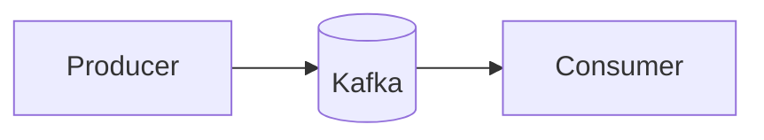

# Backend Engineering, Explained

A fast, **free**, SEO-optimized static learning site that turns a large Q&A
knowledge base into a beautiful, searchable, **diagram-rich** website.

Built with [Astro](https://astro.build) + [Starlight](https://starlight.astro.build):

- ⚡ **Fully static** — hosts free on GitHub Pages, loads instantly
- 🔍 **Built-in full-text search** (Ctrl/⌘ + K)
- 🧭 **Mermaid diagrams** rendered for every key concept
- 🌗 **Light/dark mode**, mobile-friendly, accessible
- 🔎 **SEO-first** — Open Graph + Twitter cards, sitemap, robots.txt, JSON-LD,
  canonical URLs, keyword meta, and a generated 1200×630 social image

> Live site (after first deploy): **https://hamza-afraiz.github.io/Python-learning/**

---

## Local development

```bash
npm install
npm run dev        # generates content, then starts the dev server
```

Open http://localhost:4321/Python-learning/

### Useful scripts

| Command | What it does |
|---|---|
| `npm run gen` | Parse `src/data/QA.md` → generate Q&A pages + OG image |
| `npm run dev` | Generate content, then run the dev server |
| `npm run build` | Generate content, then build the static site into `dist/` |
| `npm run preview` | Preview the production build locally |

---

## How content works

- **Source of truth:** `src/data/QA.md`. To add knowledge, edit this file (the
  same `## Session` / `### Q:` format) and re-run `npm run gen`.
- **Auto-generated:** `scripts/generate-content.mjs` splits each session into its
  own page under `src/content/docs/qa/`, turning every question into an H2 so it
  appears in the page's table of contents.
- **Hand-written visual guides:** `src/content/docs/concepts/*.md` — the
  diagram-rich explainers (Architecture, Storage, Messaging, Async, Observability).
- **Homepage:** `src/content/docs/index.mdx`.

---

## Deploying to GitHub Pages

This repo includes `.github/workflows/deploy.yml`. To go live:

1. Push this project to **https://github.com/Hamza-Afraiz/Python-learning**
   (branch `main`).
2. In the repo: **Settings → Pages → Build and deployment → Source =
   GitHub Actions**.
3. Every push to `main` builds and deploys automatically.

> If you rename the repo or add a custom domain, update `site` and `base` at the
> top of `astro.config.mjs` (and the `Sitemap:` line in `public/robots.txt`).

---

## Adding diagrams

Use a fenced ` ```mermaid ` block in any Markdown file:

````markdown

````

They render client-side and follow the light/dark theme automatically.
