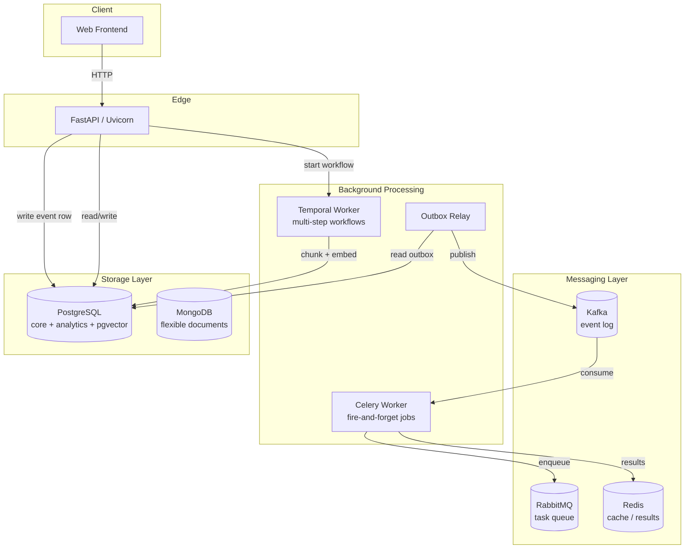
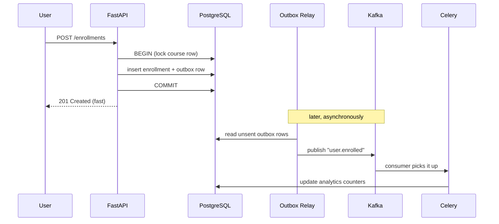

This guide gives you the **mental map** of a real backend system. Every other
guide zooms into one box on this diagram.

## The big picture

## What each layer is responsible for

| Layer | Component | Job |
|---|---|---|
| **Edge** | FastAPI + Uvicorn | Handle HTTP, auth, validation. Returns fast. |
| **Workflow** | Temporal worker | Long, multi-step, *stateful* orchestration (e.g. publish a course → extract → chunk → embed). |
| **Tasks** | Celery worker | Independent fire-and-forget jobs (send email, generate PDF). |
| **Event log** | Kafka | Durable stream of *facts* (`course.published`) many consumers can replay. |
| **Task queue** | RabbitMQ | Broker that hands one job to one worker. |
| **Cache** | Redis | Fast ephemeral state and Celery result backend. |
| **Core data** | PostgreSQL | Users, courses, enrollments, analytics, and vector search. |
| **Documents** | MongoDB | Flexible, schema-light content where it fits. |

## How one request flows: enrolling in a course

The key idea: **the user-facing write is fast and transactional**, while the
slow, fan-out work (analytics, notifications) happens **asynchronously** and is
guaranteed not to be lost — thanks to the *outbox* pattern.

## Why an "outbox" instead of publishing to Kafka directly

If the API wrote to PostgreSQL **and then** published to Kafka as two separate
steps, a crash in between would lose the event. Instead, the event is written as
a **row in the same database transaction** as the business data. A separate
**relay** process reads those rows and publishes them. Same transaction = no
lost events.

```mermaid
flowchart LR
    TX["One DB transaction"] --> A[business row]
    TX --> B[outbox row]
    B -.-> R[Relay] -.-> K[(Kafka)]
    style TX fill:#16243a,stroke:#3b82f6
```

→ Dive deeper in [Messaging & Events](/Python-learning/concepts/messaging/) and
the [Q&A sessions](/Python-learning/qa/session-1/).
