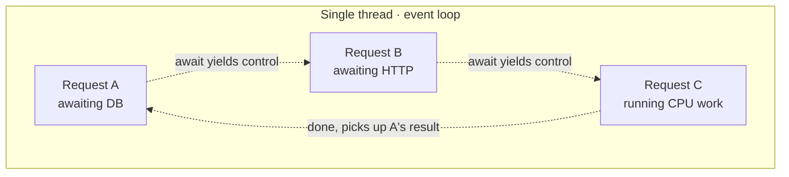
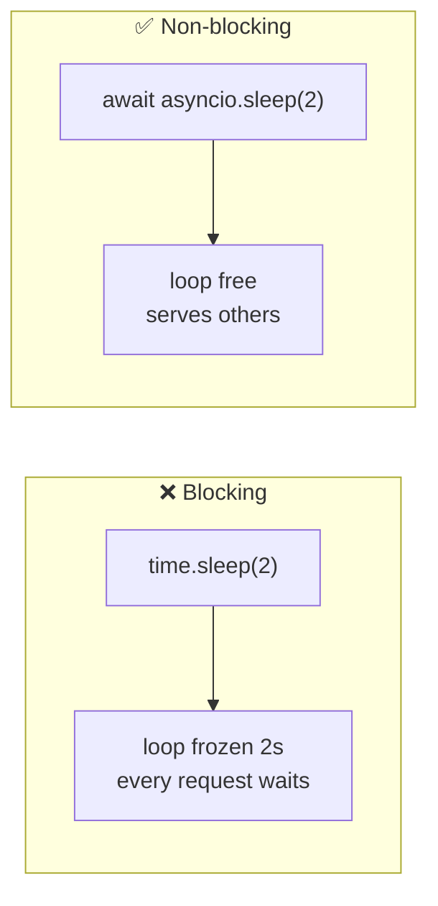
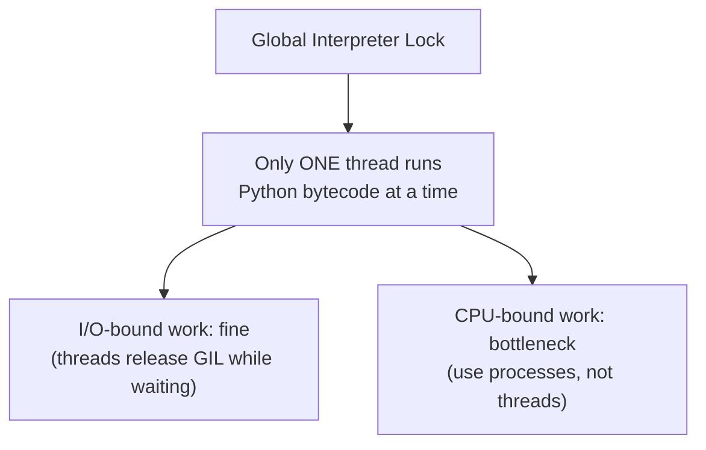
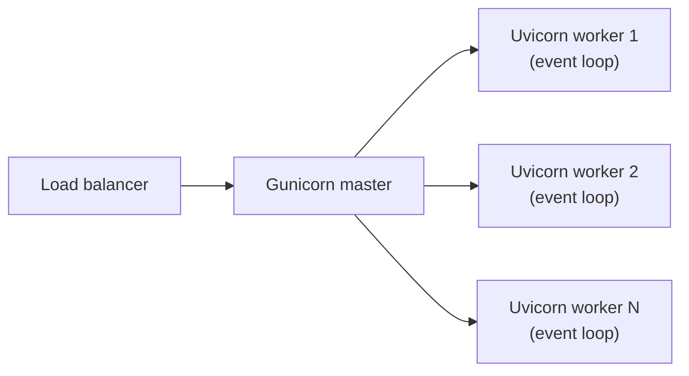

Async Python is simple once you picture **one cook (the event loop)** juggling
many orders by never standing idle while something bakes.

## The event loop, visually

While Request A waits on the database, the loop **runs B and C**. Nothing is
truly parallel on one thread — it's *cooperative*. The magic word is `await`:
it means "I'm waiting; let someone else run."

## The cardinal sin: blocking the loop

If one task does **synchronous** work, the *entire* loop freezes — no other
request is served until it finishes.

| ❌ Blocks the loop | ✅ Yields properly |
|---|---|
| `time.sleep(2)` | `await asyncio.sleep(2)` |
| `requests.get(...)` | `await httpx_client.get(...)` |
| sync SQLAlchemy session | async SQLAlchemy session |
| `bcrypt.hashpw(...)` on main thread | run it in a thread pool |

The rule: **anything that waits must `await`; anything CPU-heavy must move off
the loop** (thread/process pool).

## Why this differs from Node.js

Node is async *by default* — almost every I/O API is non-blocking out of the
box. In Python, async is **opt-in**: you must choose async libraries and `await`
them, or you'll accidentally block. Same event-loop concept, different defaults.

## The GIL — what it actually limits

The GIL means threads don't give you CPU parallelism for pure-Python work. For
I/O (databases, HTTP) it's a non-issue. For CPU-heavy work, scale with
**processes**.

## Uvicorn vs Gunicorn in production

- **Uvicorn** runs your async app on **one** event loop (one CPU core).
- **Gunicorn** is the **process manager** that runs *many* Uvicorn workers — one
  per core — to use the whole machine and restart crashed workers.

So you get concurrency *within* a worker (the event loop) **and** parallelism
*across* workers (multiple processes). Best of both.

→ More in the [async & concurrency Q&A](/Python-learning/qa/session-2/).
