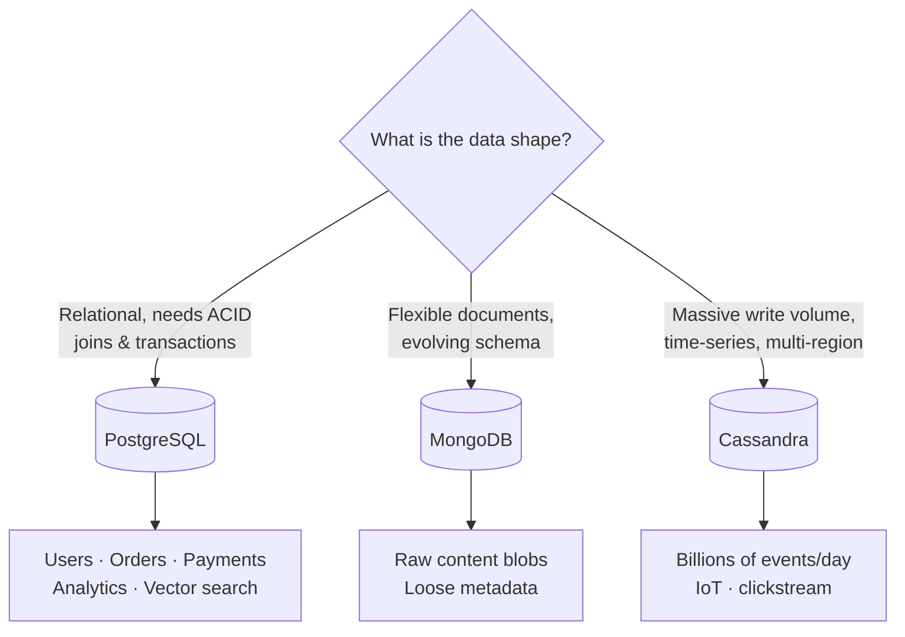
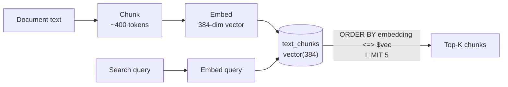

Choosing a database is about **failure modes**, not features. This guide shows
where each option shines and where it breaks.

## The three contenders at a glance

## Side-by-side

| | **PostgreSQL** | **MongoDB** | **Cassandra** |
|---|---|---|---|
| **Model** | Relational tables | JSON documents | Wide-column, partitioned |
| **Strength** | ACID, joins, constraints | Flexible schema | Linear write scaling |
| **Transactions** | Full multi-row ACID | Limited | Eventually consistent |
| **Joins** | Yes | Awkward | No |
| **Scales writes by** | Vertical + read replicas | Sharding | Adding nodes (built-in) |
| **Breaks when** | Single-node write ceiling | You need joins/ACID | You need ad-hoc queries/joins |
| **Best for here** | Core data + analytics | Optional content store | Not needed at this scale |

## Why analytics lives in PostgreSQL (not MongoDB)

A common instinct is "analytics = NoSQL." But here the analytics queries are
**relational aggregations** — counts, group-bys, joins across users and
orders. PostgreSQL does these natively and transactionally.

```mermaid
flowchart LR
    E["Order event"] --> PG[(PostgreSQL)]
    PG --> A1["COUNT orders<br/>GROUP BY product"]
    PG --> A2["JOIN users × orders"]
    PG --> A3["Window functions<br/>over time"]
    style PG fill:#16243a,stroke:#3b82f6
```

MongoDB *could* store the events, but you'd lose easy joins and transactional
counters — the exact things these queries need. So analytics stays in
PostgreSQL, in its own tables, updated by background consumers.

## Bonus: PostgreSQL also does vector search (pgvector)

The same database stores **embeddings** for semantic search — no separate vector
DB required at this scale.

This is the foundation for **semantic search** and **RAG** — finding the
paragraph that *means* the same thing as your query, not just one that shares
keywords.

→ See the Q&A for the full reasoning:
[storage decisions](/Python-learning/qa/session-1/) and
[chunks & embeddings](/Python-learning/qa/session-4/).
