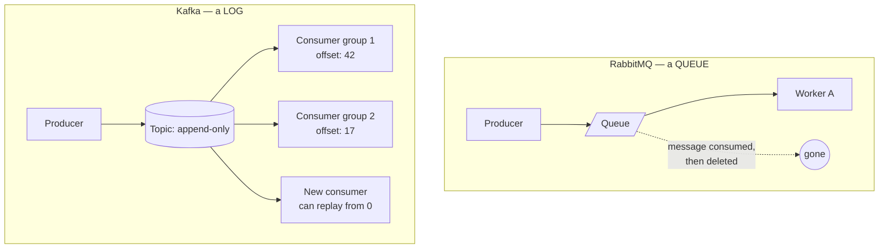
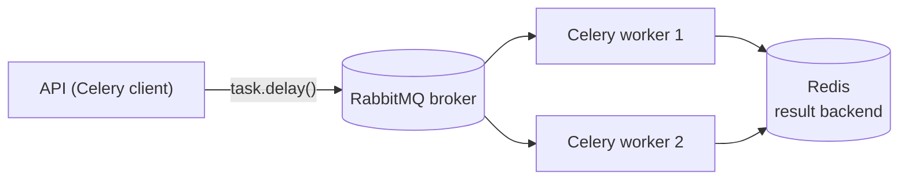
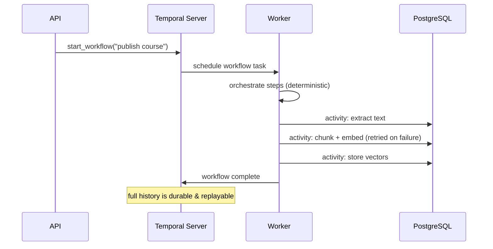
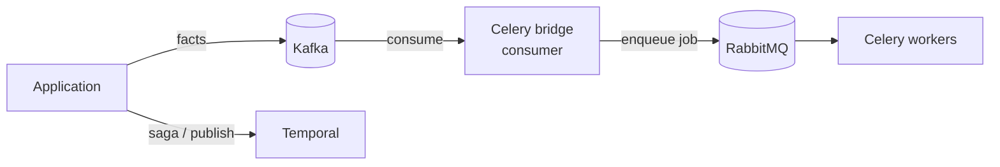

These four tools get confused constantly. They live at **different layers** and
solve **different problems**. This guide separates them for good.

## One sentence each

| Tool | What it really is |
|---|---|
| **RabbitMQ** | A **message broker** — queues and routing. One consumer takes a message and it's gone. |
| **Kafka** | A **distributed event log** — durable facts in topics, replayable by many consumers. |
| **Celery** | A **task framework** — workers that run discrete jobs pulled from a broker. |
| **Temporal** | A **workflow engine** — durable, multi-step, stateful orchestration with retries. |

## Queue vs Log: the core distinction

- **RabbitMQ**: a kitchen order ticket — the next cook grabs **one** job and it
  leaves the rail.
- **Kafka**: a bank ledger line — everyone can **read** it, each team keeps its
  own bookmark (offset), and new readers can replay history.

## Where Celery fits

Celery is **not** a broker. It's a framework: your code **publishes** a task
message to a broker (usually RabbitMQ), and separate **Celery worker** processes
consume and run it.

## Where Temporal fits

Temporal is for **multi-step, stateful** work that must survive crashes and
retry individual steps. A **server** stores the workflow history; **workers**
poll a task queue and run workflow + activity code.

If a single activity fails, Temporal **retries just that step** — without
re-running the whole workflow. That's the difference from a plain task queue.

## How they compose (they don't replace each other)

A typical real system uses **all of them**: Kafka for durable events, a consumer
that bridges events into **Celery tasks** via **RabbitMQ**, and **Temporal** for
the complex orchestrations. They complement; none is a drop-in replacement for
the others.

→ Full discussion in the
[Temporal & brokers Q&A](/Python-learning/qa/session-3/) and
[outbox & idempotency](/Python-learning/qa/session-4/).
