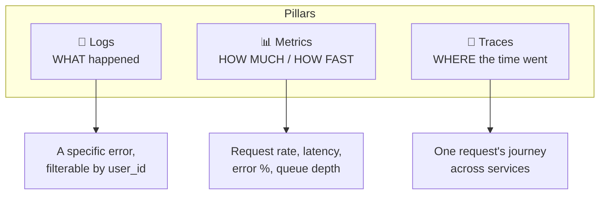
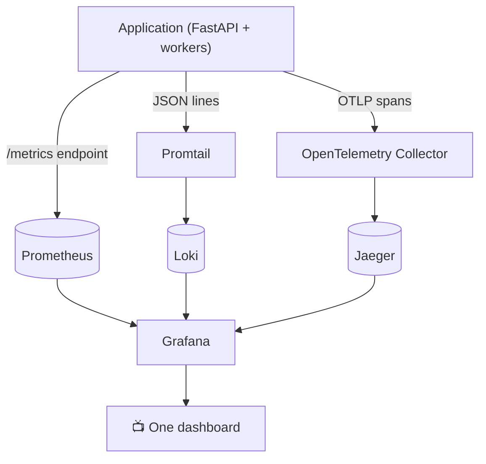
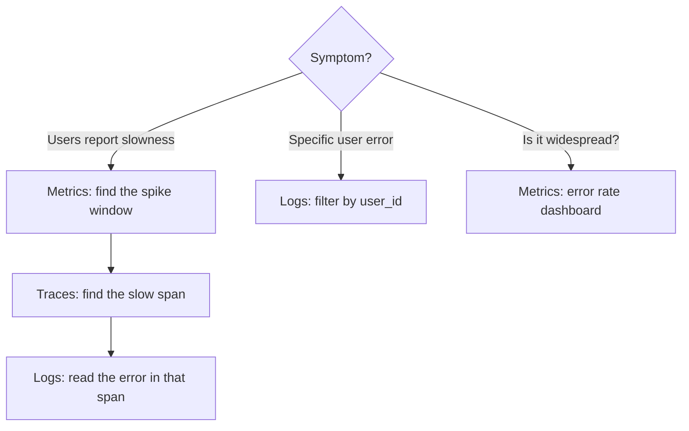

You can't fix what you can't see. Observability stands on **three pillars**, and
each answers a different question.

## The three pillars

| Pillar | Answers | Tool here |
|---|---|---|
| **Logs** | *What* happened, in detail | JSON logs → Loki → Grafana |
| **Metrics** | *How much / how fast*, in aggregate | Prometheus → Grafana |
| **Traces** | *Where* time was spent across services | OpenTelemetry → Jaeger |

## Why you need all three

Metrics tell you **"latency spiked at 2pm."** Traces tell you **"it spiked
inside the embedding step."** Logs tell you **"because the model failed to load
for user 123."** Each narrows the search; none replaces the others.

```mermaid
flowchart LR
    M["Metric: latency up 📈"] -->|"which request?"| T["Trace: slow span = embed step"]
    T -->|"why?"| L["Log: model load error, user 123"]
    style M fill:#16243a,stroke:#3b82f6
```

## How the stack wires up

- **Prometheus** scrapes a `/metrics` endpoint and stores time-series.
- **OpenTelemetry** emits **spans**; **Jaeger** stores and visualizes traces.
- **Promtail** ships JSON logs into **Loki**.
- **Grafana** is the single pane of glass over all three.

## What a trace looks like

A trace is a **tree of spans** — each span is one operation, with timing. The
parent is the whole request; children are the steps inside it.

```mermaid
gantt
    title One request: POST /enrollments (trace)
    dateFormat X
    axisFormat %s
    section Request
    HTTP handler        :a, 0, 9
    section Steps
    Auth check          :0, 1
    DB transaction      :1, 4
    Publish outbox row  :4, 5
    Serialize response  :5, 6
```

## Where to look first when something breaks

Start broad (**metrics**), narrow to the request (**traces**), then read the
detail (**logs**). That order saves the most time.

→ Full walkthrough in the
[observability Q&A](/Python-learning/qa/session-4/).
