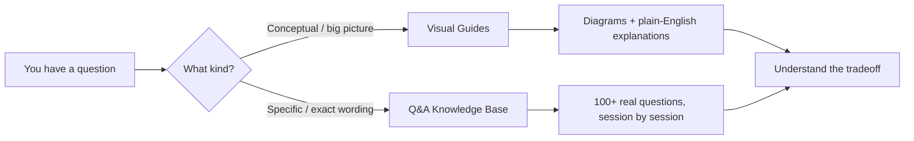

This site has two halves that work together.

## The two halves

- **Visual Guides** — curated, diagram-first explanations of the big topics
  (architecture, storage, messaging, async, observability). Start here if you
  want the mental model.
- **Q&A Knowledge Base** — the raw, chronological log of every question asked
  while building a real system. Start here if you want a *specific* answer.

## Tips

- **Search everything** with <kbd>Ctrl</kbd>/<kbd>⌘</kbd> + <kbd>K</kbd>.
- Every page has a **table of contents** on the right — in the Q&A pages, each
  entry is one question.
- Use the **theme toggle** (top-right) for light/dark. Diagrams follow the theme.
- Pages are fully static, so they load instantly and work offline once cached.

## Who it's for

Backend and full-stack engineers preparing for **system-design interviews**, or
anyone who wants the *reasoning* behind real infrastructure choices — not just
the commands.
